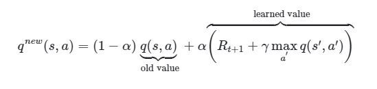
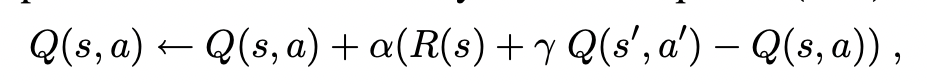

# Sticks 
### A Q-learning example

The goal of this repository is to create an environment where a computer 
program learns how to play and hopefully win (or at least not lose) at the game of sticks. The rules of the game are
summed up nicely [here](https://frugalfun4boys.com/play-sticks-finger-game-kids/).

The learning method this program uses is called Q-Learning.  For an explanation on 
Q-learning checkout this [playlist](https://www.youtube.com/playlist?list=PLZbbT5o_s2xoWNVdDudn51XM8lOuZ_Njv) 
by the awesome folks at DeepLizard.  I have no connection to Deeplizard at all. I'm not getting a kickback or anything.
I just think they are great and produce very high quality content. 

### Requirements:
 - python 3.8+
 - nodeJS 12.16+

### Installation:
I'll assume you have a python 3 environment and have already cloned this repo. 
Enter into the repository root directory and install the requirred python pages by running the command below.

```pip install -r requirements.txt```

(Optional) Next enter into the website/frontend directory and build the angular app with the following commands.

```npm install```

```./node_modules/.bin/ng build```

## Alternate installation 
If you are familiar with docker, and can run linux based images grab the latest version on [dockerhub/sticks](https://hub.docker.com/repository/docker/mweltin/sticks)


### Q-learning
To run the Q-Learning algorithm enter into sticks/training directory.  Verify that the sticks root directory is in
your PYTHONPATH environment variable.

```export PYTHONPATH={ABSOLUTE PATH TO}/sticks```
T
hen run the following command
```python qlearning.py```

The output from this program is a file called q_table.csv.  This file holds the information the algorithm "learned"

### Playing the game (command line version)
Assuming the installation and Q-learning instructions above were followed you are now ready to play the game. To 
start the game run the following command from the repository's root directory.

```python main.py```

Then follow the instructions in the console.

### Playing the game (web based version) 
This requires you have built the angular app.  This was the optional step defined in the installation instructions above.  Enter into the website 
directory and run the following command.

```python manage.py runserver```

This will launch the site at http://localhost:8000 by default

### Playing the game hosted online version  
My generous employer PATTAN has agreed to host an online version for educational and evaluation purposes.
You can play a trained version of the game [here](http://tina.pattan.net:8001).
In the upper right you can select a specifically trained agent.  The select if you want to go first or let the agent go 
first.  When it is your turn, click on the hand you want to play, and then on the opponents hand you want to tap. An 
box will pop-up when someone wins. 

### Alternate git branches
Everything you need to train and customize a q-learning, wolf or dual agent algorithm can be found in the 'main' branch.  
However, if you want to explore an alternate reward function, different training methods, or different q-table update
functions there are different branches for that. 
1) main - 
   1) This branch uses a common adjustment to the bellman equation to update the q-table.  Rather than subtracting off the current q-table value the q-table value is multiplied by 1-learning rate 
2) bellman - 
   1) This branch uses the q-table update function that matches the temperal difference Q-learning update equation found in Artificial Intelligence A Modern Approach
Third Edition by Stuart J. Russell and Peter Norvig 
3) keepbest -
   1) This branch starts each training by initializing the Q-table for the agent with the Q-table that had the best reward from the previous training attempt
4) reward -
   1) Finally, this branch changes the reward function.  It gives 0.5 for getting close to a winning hand, -0.5 for getting close to a losing hand,  1 for a win, -1 for a loss and zero for all other states.

### Unit tests
To run tests use unittest from the tests directory

```$ python -m unittest discover -s ./tests```

For code coverage run coverage and then reports

```$ coverage run -m unittest discover -s ./tests  ```
```$ coverage report```

### Docker
Build it yourself

```docker build -t {add your tag name} .```

run it

```docker run -d -p 8000:8000 --name sticks {your tag}```
